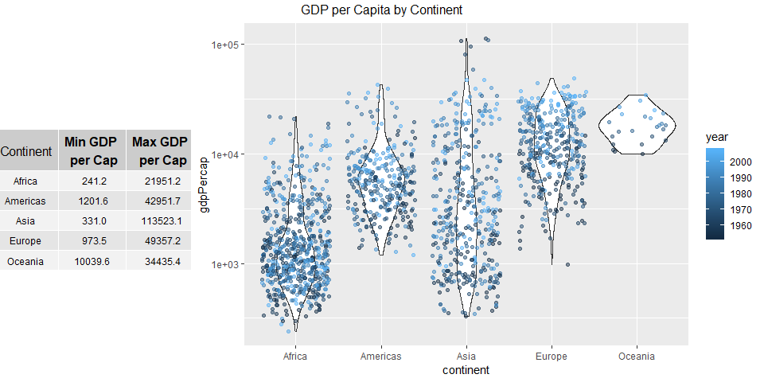
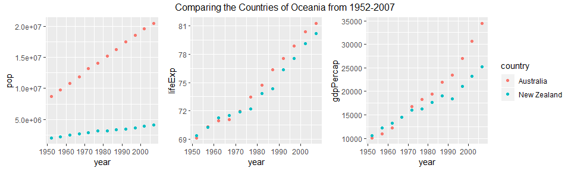

STAT 545A Homework 3
================
Lucy Bellemare
September 30, 2018

Homework 3
==========

-   [Introduction](#introduction)
    -   [Load Packages](#load-packages)
-   [Get the maximum and minimum of GDP per capita for all continents.](#get-the-maximum-and-minimum-of-gdp-per-capita-for-all-continents)
-   [Computing Alternative Mean Life Expectancy](#computing-alternative-mean-life-expectancy)

Introduction
============

The goal of this assignment is to explore the use of dplyr and ggplot2 to explore, draw conclusions, and visualize datasets.

Load Packages
-------------

``` r
library(tidyverse)
library(knitr)
library(gridExtra)
library(gapminder)
```

Get the maximum and minimum of GDP per capita for all continents
================================================================

``` r
gapminder %>% 
  group_by(continent) %>% 
  summarize(minGDPperCap = min(gdpPercap),
            maxGDPperCap = max(gdpPercap)) %>% 
  mutate(rangeGDPperCap = maxGDPperCap - minGDPperCap) %>% 
  knitr::kable()
```

| continent |  minGDPperCap|  maxGDPperCap|  rangeGDPperCap|
|:----------|-------------:|-------------:|---------------:|
| Africa    |      241.1659|      21951.21|        21710.05|
| Americas  |     1201.6372|      42951.65|        41750.02|
| Asia      |      331.0000|     113523.13|       113192.13|
| Europe    |      973.5332|      49357.19|        48383.66|
| Oceania   |    10039.5956|      34435.37|        24395.77|

From this we can see the maximum and minimum GDP per capita for each continent, considering from 1952-2007. We can see that Africa has the lowest minimum GDP per capita and the lowest maximum GDP per capita. We also can see that Asia has the largest different between their minimum and maximum GDP per capitas.

To better visualize the spread of the data, we can see:

``` r
#Building the below violin plot with jittered points added
minMaxGDPPlot <- ggplot(gapminder, aes(continent, gdpPercap, colour=year)) +
  scale_y_log10() +
  geom_violin() + 
  geom_jitter(alpha=0.5)

#Taking the table from the above code chunk and storing it in a variable
minMaxGDPTable <- gapminder %>% 
  group_by(continent) %>% 
  summarize(minGDPperCap = round(min(gdpPercap), 1),
            maxGDPperCap = round(max(gdpPercap), 1)) %>% 
  mutate(rangeGDPperCap = maxGDPperCap - minGDPperCap)

# Set theme to customize sizing of the table
tt <- ttheme_default(colhead=list(fg_params = list(parse=TRUE)), 
                     core = list(fg_params=list(cex = 0.75)),
                     colhead = list(fg_params=list(cex = 0.25)),
                     rowhead = list(fg_params=list(cex = 0.25)))
# Converting the data frame/tible into a 'grob' that can be accepted by grid.arrange
minMaxGDPTableGrob <- tableGrob(minMaxGDPTable[,c(1:3)], 
                                cols = c("Continent", 
                                         "Min GDP \n per Cap", 
                                         "Max GDP \n per Cap"), 
                                rows=NULL, theme=tt)
# Plot chart and table into one object
grid.arrange(minMaxGDPTableGrob, minMaxGDPPlot,  
             nrow=2, ncol=4,
             layout_matrix = rbind(c(1,rep(2,3)), c(1,rep(2,3))),
             as.table=TRUE,
             top = "GDP per Capita by Continent")
```



Computing Alternative Mean Life Expectancy
==========================================

Compute a trimmed mean of life expectancy for different years. Or a weighted mean, weighting by population. Just try something other than the plain vanilla mean.

Let's try three different ways to calculate average life expectancy:

-   Mean life expectancy by country, regardless of year
-   Weighted mean that weights life expectancy by population in 1952 and 2007
-   Trimmed mean life by year that removes the top 5% and bottom 5% values

Mean Life Expectancy by Country
-------------------------------

``` r
gapminder %>% 
  group_by(country) %>% 
  summarize(meanLifeExp = mean(lifeExp)) %>% 
  kable()
```

| country                  |  meanLifeExp|
|:-------------------------|------------:|
| Afghanistan              |     37.47883|
| Albania                  |     68.43292|
| Algeria                  |     59.03017|
| Angola                   |     37.88350|
| Argentina                |     69.06042|
| Australia                |     74.66292|
| Austria                  |     73.10325|
| Bahrain                  |     65.60567|
| Bangladesh               |     49.83408|
| Belgium                  |     73.64175|
| Benin                    |     48.77992|
| Bolivia                  |     52.50458|
| Bosnia and Herzegovina   |     67.70783|
| Botswana                 |     54.59750|
| Brazil                   |     62.23950|
| Bulgaria                 |     69.74375|
| Burkina Faso             |     44.69400|
| Burundi                  |     44.81733|
| Cambodia                 |     47.90275|
| Cameroon                 |     48.12850|
| Canada                   |     74.90275|
| Central African Republic |     43.86692|
| Chad                     |     46.77358|
| Chile                    |     67.43092|
| China                    |     61.78514|
| Colombia                 |     63.89775|
| Comoros                  |     52.38175|
| Congo, Dem. Rep.         |     44.54375|
| Congo, Rep.              |     52.50192|
| Costa Rica               |     70.18142|
| Cote d'Ivoire            |     48.43617|
| Croatia                  |     70.05592|
| Cuba                     |     71.04508|
| Czech Republic           |     71.51050|
| Denmark                  |     74.37017|
| Djibouti                 |     46.38075|
| Dominican Republic       |     61.55450|
| Ecuador                  |     62.81683|
| Egypt                    |     56.24300|
| El Salvador              |     59.63333|
| Equatorial Guinea        |     42.96000|
| Eritrea                  |     45.99925|
| Ethiopia                 |     44.47575|
| Finland                  |     72.99192|
| France                   |     74.34892|
| Gabon                    |     51.22050|
| Gambia                   |     44.40058|
| Germany                  |     73.44442|
| Ghana                    |     52.34067|
| Greece                   |     73.73317|
| Guatemala                |     56.72942|
| Guinea                   |     43.23983|
| Guinea-Bissau            |     39.21025|
| Haiti                    |     50.16525|
| Honduras                 |     57.92083|
| Hong Kong, China         |     73.49283|
| Hungary                  |     69.39317|
| Iceland                  |     76.51142|
| India                    |     53.16608|
| Indonesia                |     54.33575|
| Iran                     |     58.63658|
| Iraq                     |     56.58175|
| Ireland                  |     73.01725|
| Israel                   |     73.64583|
| Italy                    |     74.01383|
| Jamaica                  |     68.74933|
| Japan                    |     74.82692|
| Jordan                   |     59.78642|
| Kenya                    |     52.68100|
| Korea, Dem. Rep.         |     63.60733|
| Korea, Rep.              |     65.00100|
| Kuwait                   |     68.92233|
| Lebanon                  |     65.86567|
| Lesotho                  |     50.00708|
| Liberia                  |     42.47625|
| Libya                    |     59.30417|
| Madagascar               |     47.77058|
| Malawi                   |     43.35158|
| Malaysia                 |     64.27958|
| Mali                     |     43.41350|
| Mauritania               |     52.30208|
| Mauritius                |     64.95325|
| Mexico                   |     65.40883|
| Mongolia                 |     55.89033|
| Montenegro               |     70.29917|
| Morocco                  |     57.60883|
| Mozambique               |     40.37950|
| Myanmar                  |     53.32167|
| Namibia                  |     53.49133|
| Nepal                    |     48.98633|
| Netherlands              |     75.64850|
| New Zealand              |     73.98950|
| Nicaragua                |     58.34942|
| Niger                    |     44.55867|
| Nigeria                  |     43.58133|
| Norway                   |     75.84300|
| Oman                     |     58.44267|
| Pakistan                 |     54.88225|
| Panama                   |     67.80175|
| Paraguay                 |     66.80908|
| Peru                     |     58.85933|
| Philippines              |     60.96725|
| Poland                   |     70.17692|
| Portugal                 |     70.41983|
| Puerto Rico              |     72.73933|
| Reunion                  |     66.64425|
| Romania                  |     68.29067|
| Rwanda                   |     41.48158|
| Sao Tome and Principe    |     57.89633|
| Saudi Arabia             |     58.67875|
| Senegal                  |     50.62592|
| Serbia                   |     68.55100|
| Sierra Leone             |     36.76917|
| Singapore                |     71.22025|
| Slovak Republic          |     70.69608|
| Slovenia                 |     71.60075|
| Somalia                  |     40.98867|
| South Africa             |     53.99317|
| Spain                    |     74.20342|
| Sri Lanka                |     66.52608|
| Sudan                    |     48.40050|
| Swaziland                |     49.00242|
| Sweden                   |     76.17700|
| Switzerland              |     75.56508|
| Syria                    |     61.34617|
| Taiwan                   |     70.33667|
| Tanzania                 |     47.91233|
| Thailand                 |     62.20025|
| Togo                     |     51.49875|
| Trinidad and Tobago      |     66.82800|
| Tunisia                  |     60.72100|
| Turkey                   |     59.69642|
| Uganda                   |     47.61883|
| United Kingdom           |     73.92258|
| United States            |     73.47850|
| Uruguay                  |     70.78158|
| Venezuela                |     66.58067|
| Vietnam                  |     57.47950|
| West Bank and Gaza       |     60.32867|
| Yemen, Rep.              |     46.78042|
| Zambia                   |     45.99633|
| Zimbabwe                 |     52.66317|

Weighted Mean Life Expectancy
-----------------------------

By Country:

``` r
gapminder %>% 
  mutate(weightedLifeExp = lifeExp * pop) %>% 
  group_by(country) %>% 
  summarize(MeanWeightedLifeExp = (sum(as.numeric(weightedLifeExp)) / sum(as.numeric(pop)))) %>% 
  kable()
```

| country                  |  MeanWeightedLifeExp|
|:-------------------------|--------------------:|
| Afghanistan              |             39.17119|
| Albania                  |             70.21007|
| Algeria                  |             63.05490|
| Angola                   |             39.02700|
| Argentina                |             70.07024|
| Australia                |             75.66749|
| Austria                  |             73.32872|
| Bahrain                  |             69.81501|
| Bangladesh               |             52.98928|
| Belgium                  |             73.81851|
| Benin                    |             51.42856|
| Bolivia                  |             55.56364|
| Bosnia and Herzegovina   |             68.49818|
| Botswana                 |             54.80124|
| Brazil                   |             64.64616|
| Bulgaria                 |             69.85461|
| Burkina Faso             |             46.83979|
| Burundi                  |             45.77564|
| Cambodia                 |             50.28885|
| Cameroon                 |             49.67085|
| Canada                   |             75.77951|
| Central African Republic |             44.92163|
| Chad                     |             48.42447|
| Chile                    |             69.76966|
| China                    |             64.24594|
| Colombia                 |             66.29904|
| Comoros                  |             56.08839|
| Congo, Dem. Rep.         |             45.12370|
| Congo, Rep.              |             53.71774|
| Costa Rica               |             73.14528|
| Cote d'Ivoire            |             49.38504|
| Croatia                  |             70.24071|
| Cuba                     |             72.14416|
| Czech Republic           |             71.58687|
| Denmark                  |             74.50915|
| Djibouti                 |             49.95527|
| Dominican Republic       |             64.63917|
| Ecuador                  |             66.36373|
| Egypt                    |             60.11922|
| El Salvador              |             62.47860|
| Equatorial Guinea        |             44.59416|
| Eritrea                  |             48.62670|
| Ethiopia                 |             46.61236|
| Finland                  |             73.28337|
| France                   |             74.79875|
| Gabon                    |             54.14104|
| Gambia                   |             49.90655|
| Germany                  |             73.62700|
| Ghana                    |             54.68802|
| Greece                   |             74.17724|
| Guatemala                |             60.52042|
| Guinea                   |             46.52832|
| Guinea-Bissau            |             40.76142|
| Haiti                    |             52.13651|
| Honduras                 |             62.24365|
| Hong Kong, China         |             75.54574|
| Hungary                  |             69.42664|
| Iceland                  |             77.09266|
| India                    |             56.09426|
| Indonesia                |             57.80601|
| Iran                     |             62.37336|
| Iraq                     |             58.28257|
| Ireland                  |             73.41736|
| Israel                   |             75.47932|
| Italy                    |             74.29696|
| Jamaica                  |             69.53206|
| Japan                    |             75.61421|
| Jordan                   |             65.94319|
| Kenya                    |             54.20441|
| Korea, Dem. Rep.         |             65.31650|
| Korea, Rep.              |             67.46982|
| Kuwait                   |             73.29020|
| Lebanon                  |             67.12967|
| Lesotho                  |             50.61360|
| Liberia                  |             43.18341|
| Libya                    |             64.83924|
| Madagascar               |             50.86156|
| Malawi                   |             45.21549|
| Malaysia                 |             67.31167|
| Mali                     |             45.66167|
| Mauritania               |             55.20500|
| Mauritius                |             66.45599|
| Mexico                   |             68.33346|
| Mongolia                 |             58.88278|
| Montenegro               |             71.12191|
| Morocco                  |             61.03082|
| Mozambique               |             41.62170|
| Myanmar                  |             55.34716|
| Namibia                  |             55.01656|
| Nepal                    |             52.47688|
| Netherlands              |             75.97093|
| New Zealand              |             74.64866|
| Nicaragua                |             62.88380|
| Niger                    |             47.23346|
| Nigeria                  |             45.02803|
| Norway                   |             76.06150|
| Oman                     |             65.96143|
| Pakistan                 |             57.89677|
| Panama                   |             70.02297|
| Paraguay                 |             68.03501|
| Peru                     |             62.33680|
| Philippines              |             63.94656|
| Poland                   |             70.60218|
| Portugal                 |             70.80683|
| Puerto Rico              |             73.42263|
| Reunion                  |             69.10995|
| Romania                  |             68.56727|
| Rwanda                   |             40.99518|
| Sao Tome and Principe    |             60.06699|
| Saudi Arabia             |             65.36073|
| Senegal                  |             54.65331|
| Serbia                   |             69.12651|
| Sierra Leone             |             37.95063|
| Singapore                |             73.48268|
| Slovak Republic          |             70.99802|
| Slovenia                 |             71.95397|
| Somalia                  |             42.56075|
| South Africa             |             55.15581|
| Spain                    |             74.76689|
| Sri Lanka                |             67.69173|
| Sudan                    |             51.62755|
| Swaziland                |             49.61324|
| Sweden                   |             76.38597|
| Switzerland              |             76.04554|
| Syria                    |             66.10671|
| Taiwan                   |             71.94641|
| Tanzania                 |             49.20349|
| Thailand                 |             64.15074|
| Togo                     |             54.42864|
| Trinidad and Tobago      |             67.34231|
| Tunisia                  |             64.14539|
| Turkey                   |             62.66312|
| Uganda                   |             48.42621|
| United Kingdom           |             74.08957|
| United States            |             74.08570|
| Uruguay                  |             71.15893|
| Venezuela                |             69.07864|
| Vietnam                  |             61.66761|
| West Bank and Gaza       |             64.83924|
| Yemen, Rep.              |             51.71735|
| Zambia                   |             45.20961|
| Zimbabwe                 |             51.95255|

``` r
#We use the function as.numeric() to resolve the following error:
#"integer overflow - use sum(as.numeric(.))"
```

By Continent, comparing 1952 and 2007:

``` r
WMLifeExp1952 <- gapminder %>% 
  filter(year == 1952) %>% 
  group_by(continent) %>% 
  mutate(weightedLifeExp = pop * lifeExp) %>% 
  summarize(MWLifeExp1952 = sum(weightedLifeExp) / sum(pop))

WMLifeExp2007 <- gapminder %>% 
  filter(year == 2007) %>% 
  group_by(continent) %>% 
  mutate(weightedLifeExp = pop * lifeExp) %>% 
  summarize(MWLifeExp2007 = sum(as.numeric(weightedLifeExp)) / sum(as.numeric(pop)))

inner_join(WMLifeExp1952, WMLifeExp2007)
```

    ## Joining, by = "continent"

    ## # A tibble: 5 x 3
    ##   continent MWLifeExp1952 MWLifeExp2007
    ##   <fct>             <dbl>         <dbl>
    ## 1 Africa             38.8          54.6
    ## 2 Americas           60.2          75.4
    ## 3 Asia               42.9          69.4
    ## 4 Europe             64.9          77.9
    ## 5 Oceania            69.2          81.1

Error: integer overflow - use sum(as.numeric(.))

How is life expectancy changing over time on different continents?

Report the absolute and/or relative abundance of countries with low life expectancy over time by continent: Compute some measure of worldwide life expectancy - you decide - a mean or median or some other quantile or perhaps your current age. Then determine how many countries on each continent have a life expectancy less than this benchmark, for each year.
---------------------------------------------------------------------------------------------------------------------------------------------------------------------------------------------------------------------------------------------------------------------------------------------------------------------------------------------------------------------

For this exercise, I'm going to exclude the continent of Oceania, as it has a substantially smaller sample size than the other continents, and the minimum life expectancy value observed in Oceania is:

``` r
gapminder %>% 
  filter(continent=="Oceania") %>% 
  summarize(minLifeExp = min(lifeExp)) %>% 
  kable()
```

|  minLifeExp|
|-----------:|
|       69.12|

And we will use 65 as the boundary between low and high life expectancy. If we were to include Oceania, the graphs would be uninformative as both countries in Oceania have had life expectancies greater than 65 for every year reported.

Find countries with interesting stories. Open-ended and, therefore, hard. Promising but unsuccessful attempts are encouraged. This will generate interesting questions to follow up on in class.

How is Oceania doing
--------------------

In the continent of Oceania, there are two countries. Let's see how they compare to each other over time.

First let's build a dataset of just these two countries:

``` r
Oceania <- gapminder %>% 
  filter(continent=="Oceania")
unique(Oceania$country)
```

    ## [1] Australia   New Zealand
    ## 142 Levels: Afghanistan Albania Algeria Angola Argentina ... Zimbabwe

We note that while the dataset Oceania has only data for the countries Australia and New Zealand, the varaible country still contains all 142 levels from the original dataset. This makes sense as country is a factor. Factors require all levels be encoded in the variable, regardless of whether or not they are still present in a new data frame.

### Initial Plots

``` r
OPopVsYear <- ggplot(Oceania, aes(x=year, y=pop)) +
  # scale_y_log10() +
  geom_point(aes(colour=country), show.legend=F)

OLifeExpVsYear <- ggplot(Oceania, aes(x=year, y=lifeExp)) +
  # scale_y_log10() +
  geom_point(aes(colour=country), show.legend=F)

OGDPPercapVsYear <- ggplot(Oceania, aes(x=year, y=gdpPercap)) +
  # scale_y_log10() +
  geom_point(aes(colour=country))

grid.arrange(OPopVsYear, OLifeExpVsYear, OGDPPercapVsYear,
             ncol = 7, nrow = 2, layout_matrix = rbind(c(1,1,2,2,3,3,3), c(1,1,2,2,3,3,3)),
             top = "Comparing the Countries of Oceania from 1952-2007")
```



### GDP per Capita

Life Expectancy
---------------
