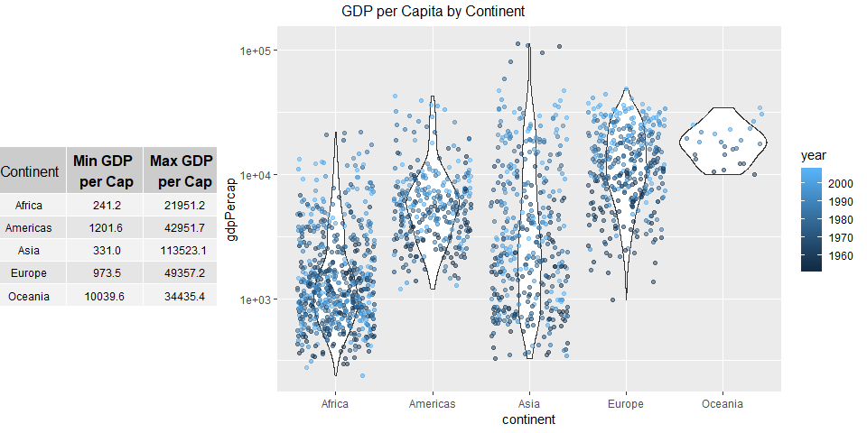

STAT 545A Homework 3
================
Lucy Bellemare
September 30, 2018

Homework 3
==========

-   [Introduction](#introduction)
    -   [Load Packages](#load-packages)
-   [Get the maximum and minimum of GDP per capita for all continents.](#get-the-maximum-and-minimum-of-gdp-per-capita-for-all-continents)
-   [Computing Alternative Mean Life Expectancy](#computing-alternative-mean-life-expectancy)
    -   [Mean Life Expectancy by Country](#mean-life-expectancy-by-country)
    -   [Weighted Mean Life Expectancy by Continent](#weighted-mean-life-expectancy-by-continent)
    -   [Trimmed mean life by year that removes the top 5% and bottom 5% values within a continent](#trimmed-mean-life-by-year-that-removes-the-top-5-percent-and-bottom-5-percent-values-within-a-continent)
-   [Report Countries With Low Life Expectancy Over Time by Continent](#report-countries-with-low-life-expectancy-over-time-by-continent)
    -   [Countries with Life Expectancies Lower than 65 Years](#countries-with-life-expectancies-lower-than-65-years)
    -   [Countries with Life Expectancies Below the Annual Median](#countries-with-life-expectancies-below-the-annual-median)
-   [How is Oceania Doing?](#how-is-oceania-doing)
    -   [Initial Plots](#initial-plots)
    -   [Life Expectancy and GDP per Capita](#life-expectancy-and-gdp-per-capita)
    -   [Relative GDP Contributions](#relative-gdp-contributions)

Introduction
============

The goal of this assignment is to explore the use of dplyr and ggplot2 to explore, draw conclusions, and visualize datasets.

Load Packages
-------------

``` r
library(tidyverse)
library(knitr)
library(gridExtra)
library(gapminder)
#Set ggplot titles to be centred
theme_update(plot.title = element_text(hjust = 0.5))
```

Get the maximum and minimum of GDP per capita for all continents
================================================================

``` r
gapminder %>% 
  group_by(continent) %>% 
  summarize(minGDPperCap = min(gdpPercap),
            maxGDPperCap = max(gdpPercap),
            rangeGDPperCap = maxGDPperCap - minGDPperCap) %>% 
  knitr::kable()
```

| continent |  minGDPperCap|  maxGDPperCap|  rangeGDPperCap|
|:----------|-------------:|-------------:|---------------:|
| Africa    |      241.1659|      21951.21|        21710.05|
| Americas  |     1201.6372|      42951.65|        41750.02|
| Asia      |      331.0000|     113523.13|       113192.13|
| Europe    |      973.5332|      49357.19|        48383.66|
| Oceania   |    10039.5956|      34435.37|        24395.77|

From this we can see the maximum and minimum GDP per capita for each continent, considering from 1952-2007. We can see that Africa has the lowest minimum GDP per capita and the lowest maximum GDP per capita. We also can see that Asia has the largest different between their minimum and maximum GDP per capitas.

To better visualize the spread of the data, we can see:

``` r
#Building the below violin plot with jittered points added
minMaxGDPPlot <- ggplot(gapminder, aes(continent, gdpPercap, colour = year)) +
  scale_y_log10() +
  geom_violin() + 
  geom_jitter(alpha=0.5)

#Taking the table from the above code chunk and storing it in a variable
minMaxGDPTable <- gapminder %>% 
  group_by(continent) %>% 
  summarize(minGDPperCap = round(min(gdpPercap), 1),
            maxGDPperCap = round(max(gdpPercap), 1),
            rangeGDPperCap = maxGDPperCap - minGDPperCap)

# Set theme to customize sizing of the table
tt <- ttheme_default(colhead=list(fg_params = list(parse = TRUE)), 
                     core = list(fg_params=list(cex = 0.75)),         #Adjusting font sizing
                     colhead = list(fg_params=list(cex = 0.25)),
                     rowhead = list(fg_params=list(cex = 0.25)))
# Converting the data frame/tible into a 'grob' that can be accepted by grid.arrange
minMaxGDPTableGrob <- tableGrob(minMaxGDPTable[,c(1:3)], 
                                cols = c("Continent", 
                                         "Min GDP \n per Cap", 
                                         "Max GDP \n per Cap"), 
                                rows=NULL, theme=tt)
# Plot chart and table into one object
grid.arrange(minMaxGDPTableGrob, minMaxGDPPlot,  
             nrow=2, ncol=4,
             layout_matrix = rbind(c(1, rep(2,3)), c(1, rep(2,3))),   #Allowing plots to be unequal sizes
             as.table=TRUE,
             top = "GDP per Capita by Continent")
```



This helps us see:

-   Contrasting shapes of violin plots: Africa and the Americas are widest in the lower half, while Europe is widest in the upper half of the distribution of GDP values
-   The minimum and maximum values for each continent are not far away from the rest of the data points. This implies that the min and max values are unlikely to be outliers, even if they may be from outlier countries or outlier years

Computing Alternative Mean Life Expectancy
==========================================

Compute a trimmed mean of life expectancy for different years. Or a weighted mean, weighting by population. Just try something other than the plain vanilla mean.

Let's try three different ways to calculate average life expectancy:

-   Mean life expectancy by country, regardless of year
-   Weighted mean that weights life expectancy by population in 1952 and 2007
-   Trimmed mean life by year that removes the top 5% and bottom 5% values within a continent

Mean Life Expectancy by Country
-------------------------------

``` r
gapminder %>% 
  group_by(country) %>% 
  summarize(meanLifeExp = mean(lifeExp)) %>% 
  kable()
```

| country                  |  meanLifeExp|
|:-------------------------|------------:|
| Afghanistan              |     37.47883|
| Albania                  |     68.43292|
| Algeria                  |     59.03017|
| Angola                   |     37.88350|
| Argentina                |     69.06042|
| Australia                |     74.66292|
| Austria                  |     73.10325|
| Bahrain                  |     65.60567|
| Bangladesh               |     49.83408|
| Belgium                  |     73.64175|
| Benin                    |     48.77992|
| Bolivia                  |     52.50458|
| Bosnia and Herzegovina   |     67.70783|
| Botswana                 |     54.59750|
| Brazil                   |     62.23950|
| Bulgaria                 |     69.74375|
| Burkina Faso             |     44.69400|
| Burundi                  |     44.81733|
| Cambodia                 |     47.90275|
| Cameroon                 |     48.12850|
| Canada                   |     74.90275|
| Central African Republic |     43.86692|
| Chad                     |     46.77358|
| Chile                    |     67.43092|
| China                    |     61.78514|
| Colombia                 |     63.89775|
| Comoros                  |     52.38175|
| Congo, Dem. Rep.         |     44.54375|
| Congo, Rep.              |     52.50192|
| Costa Rica               |     70.18142|
| Cote d'Ivoire            |     48.43617|
| Croatia                  |     70.05592|
| Cuba                     |     71.04508|
| Czech Republic           |     71.51050|
| Denmark                  |     74.37017|
| Djibouti                 |     46.38075|
| Dominican Republic       |     61.55450|
| Ecuador                  |     62.81683|
| Egypt                    |     56.24300|
| El Salvador              |     59.63333|
| Equatorial Guinea        |     42.96000|
| Eritrea                  |     45.99925|
| Ethiopia                 |     44.47575|
| Finland                  |     72.99192|
| France                   |     74.34892|
| Gabon                    |     51.22050|
| Gambia                   |     44.40058|
| Germany                  |     73.44442|
| Ghana                    |     52.34067|
| Greece                   |     73.73317|
| Guatemala                |     56.72942|
| Guinea                   |     43.23983|
| Guinea-Bissau            |     39.21025|
| Haiti                    |     50.16525|
| Honduras                 |     57.92083|
| Hong Kong, China         |     73.49283|
| Hungary                  |     69.39317|
| Iceland                  |     76.51142|
| India                    |     53.16608|
| Indonesia                |     54.33575|
| Iran                     |     58.63658|
| Iraq                     |     56.58175|
| Ireland                  |     73.01725|
| Israel                   |     73.64583|
| Italy                    |     74.01383|
| Jamaica                  |     68.74933|
| Japan                    |     74.82692|
| Jordan                   |     59.78642|
| Kenya                    |     52.68100|
| Korea, Dem. Rep.         |     63.60733|
| Korea, Rep.              |     65.00100|
| Kuwait                   |     68.92233|
| Lebanon                  |     65.86567|
| Lesotho                  |     50.00708|
| Liberia                  |     42.47625|
| Libya                    |     59.30417|
| Madagascar               |     47.77058|
| Malawi                   |     43.35158|
| Malaysia                 |     64.27958|
| Mali                     |     43.41350|
| Mauritania               |     52.30208|
| Mauritius                |     64.95325|
| Mexico                   |     65.40883|
| Mongolia                 |     55.89033|
| Montenegro               |     70.29917|
| Morocco                  |     57.60883|
| Mozambique               |     40.37950|
| Myanmar                  |     53.32167|
| Namibia                  |     53.49133|
| Nepal                    |     48.98633|
| Netherlands              |     75.64850|
| New Zealand              |     73.98950|
| Nicaragua                |     58.34942|
| Niger                    |     44.55867|
| Nigeria                  |     43.58133|
| Norway                   |     75.84300|
| Oman                     |     58.44267|
| Pakistan                 |     54.88225|
| Panama                   |     67.80175|
| Paraguay                 |     66.80908|
| Peru                     |     58.85933|
| Philippines              |     60.96725|
| Poland                   |     70.17692|
| Portugal                 |     70.41983|
| Puerto Rico              |     72.73933|
| Reunion                  |     66.64425|
| Romania                  |     68.29067|
| Rwanda                   |     41.48158|
| Sao Tome and Principe    |     57.89633|
| Saudi Arabia             |     58.67875|
| Senegal                  |     50.62592|
| Serbia                   |     68.55100|
| Sierra Leone             |     36.76917|
| Singapore                |     71.22025|
| Slovak Republic          |     70.69608|
| Slovenia                 |     71.60075|
| Somalia                  |     40.98867|
| South Africa             |     53.99317|
| Spain                    |     74.20342|
| Sri Lanka                |     66.52608|
| Sudan                    |     48.40050|
| Swaziland                |     49.00242|
| Sweden                   |     76.17700|
| Switzerland              |     75.56508|
| Syria                    |     61.34617|
| Taiwan                   |     70.33667|
| Tanzania                 |     47.91233|
| Thailand                 |     62.20025|
| Togo                     |     51.49875|
| Trinidad and Tobago      |     66.82800|
| Tunisia                  |     60.72100|
| Turkey                   |     59.69642|
| Uganda                   |     47.61883|
| United Kingdom           |     73.92258|
| United States            |     73.47850|
| Uruguay                  |     70.78158|
| Venezuela                |     66.58067|
| Vietnam                  |     57.47950|
| West Bank and Gaza       |     60.32867|
| Yemen, Rep.              |     46.78042|
| Zambia                   |     45.99633|
| Zimbabwe                 |     52.66317|

Let's try and visualize these values better:

``` r
gapminder %>% 
  group_by(country, continent) %>% 
  summarize(meanLifeExp = mean(lifeExp)) %>% 
  ggplot(aes(meanLifeExp)) +
    geom_histogram(aes(fill = continent), binwidth = 2.5) + #Adjusted bin width
    ggtitle("Distribution of Country's Mean Life Expectancy by Continent")
```


This graph helps us see:

-   Most European countries have a high mean life expectancy
-   Most African countries have a low mean life expectancy
-   Oceania has exclusively high mean life expectancies

Weighted Mean Life Expectancy by Continent
------------------------------------------

By Continent, comparing 1952 and 2007:

``` r
#Calculating weighted mean life expectancy in 1952
WMLifeExp1952 <- gapminder %>% 
  filter(year == 1952) %>% 
  group_by(continent) %>% 
  mutate(weightedLifeExp = pop * lifeExp) %>% 
  summarize(MLifeExp1952 = mean(lifeExp),
            WMLifeExp1952 = sum(weightedLifeExp) / sum(pop))

#Calculating weighted mean life expectancy in 2007
WMLifeExp2007 <- gapminder %>% 
  filter(year == 2007) %>% 
  group_by(continent) %>% 
  mutate(weightedLifeExp = pop * lifeExp) %>% 
  summarize(MLifeExp2007 = mean(lifeExp),
            WMLifeExp2007 = sum(as.numeric(weightedLifeExp)) / sum(as.numeric(pop)))

#Putting the data from 1952 and 2007 back together
kable(inner_join(WMLifeExp1952, WMLifeExp2007, by = "continent"))
```

| continent |  MLifeExp1952|  WMLifeExp1952|  MLifeExp2007|  WMLifeExp2007|
|:----------|-------------:|--------------:|-------------:|--------------:|
| Africa    |      39.13550|       38.79973|      54.80604|       54.56441|
| Americas  |      53.27984|       60.23599|      73.60812|       75.35668|
| Asia      |      46.31439|       42.94114|      70.72848|       69.44386|
| Europe    |      64.40850|       64.90540|      77.64860|       77.89057|
| Oceania   |      69.25500|       69.17040|      80.71950|       81.06215|

From this we can contrast the mean life expectancy (MLifeExp----) against the weighted mean life expectancy (WMLifeExp----) by continent. We can see that:

-   Weighted mean life expectancy differs from the mean life expectancy most in the Americas and Asia in 1952.
    -   For the Americas the weighted mean is higher than the arithmetic mean, indicating that larger countries have longer life expectancies.
    -   In Asia the weighted mean is less than the arithmetic mean, indicating that the smaller countires have longer life expectancies.
-   In 2007 the weighted life expectancies differ from the arithmetic means less than in 1952. This may indicate that there are smaller differences in life expectancy between large and small countries.

Note: In this code I used the as.numeric function to resolve the following error:

Error: integer overflow - use sum(as.numeric(.))

I believe this error was generated due to the very large population sizes, especially relative to the life expectancy values.

Trimmed mean life by year that removes the top 5 percent and bottom 5 percent values within a continent
-------------------------------------------------------------------------------------------------------

For this calculation, let's again, just print the results for 1952 and 2007, so things are a bit cleaner

``` r
gapminder %>% 
  group_by(continent, year) %>% 
  summarize(MLifeExp = mean(lifeExp),
            TMLifeExp = mean(lifeExp, trim = 0.05)) %>% #Specifying trim x% of the data (top & bottom)
  summarize(MLifeExp1952 = MLifeExp[year == 1952],      #Pulling the values for 1952
            TMLifeExp1952 = TMLifeExp[year == 1952],
            MLifeExp2007 = MLifeExp[year == 2007],
            TMLifeExp2007 = TMLifeExp[year == 2007]) %>% 
  kable()
```

| continent |  MLifeExp1952|  TMLifeExp1952|  MLifeExp2007|  TMLifeExp2007|
|:----------|-------------:|--------------:|-------------:|--------------:|
| Africa    |      39.13550|       38.98585|      54.80604|       54.53802|
| Americas  |      53.27984|       53.28987|      73.60812|       73.85365|
| Asia      |      46.31439|       46.26400|      70.72848|       71.21319|
| Europe    |      64.40850|       64.85714|      77.64860|       77.71157|
| Oceania   |      69.25500|       69.25500|      80.71950|       80.71950|

From this we can contrast the mean life expectancy (MLifeExp----) against the trimmed mean life expectancy (TMLifeExp----) by continent. We can see that the the trimmed means do not differ substantially from the arithmetic means for any continent in either 1952 or 2007. This indicates that for the years considered the tails of the distribution of life expectenacies are similar.

Report Countries With Low Life Expectancy Over Time by Continent
================================================================

Let's explore the absolute and/or relative abundance of countries with low life expectancy over time by continent: Compute some measure of worldwide life expectancy - you decide - a mean or median or some other quantile or perhaps your current age. Then determine how many countries on each continent have a life expectancy less than this benchmark, for each year.

For this exercise, I'm going to exclude the continent of Oceania, as it has a substantially smaller sample size than the other continents, and the minimum life expectancy value observed in Oceania is:

``` r
gapminder %>% 
  filter(continent == "Oceania") %>% 
  summarize(minLifeExp = min(lifeExp)) %>% 
  kable()
```

|  minLifeExp|
|-----------:|
|       69.12|

And we will use 65 as the boundary between low and high life expectancy. If we were to include Oceania, the graphs would be uninformative as both countries in Oceania have had life expectancies greater than 65 for every year reported.

Countries with Life Expectancies Lower than 65 Years
----------------------------------------------------

``` r
gapminder %>% 
  filter(continent != "Oceania") %>% 
  group_by(continent, year) %>% 
  summarize(nBelow = sum(lifeExp < 65),   #Number of countries per continent w lifeExp < 60
            pBelow = nBelow / n()) %>%    #Percent of countries per continent w lifeExp < 60
  ggplot(aes(x = year, y = pBelow)) +
    facet_wrap( ~ continent, scales = "free_x") + 
    geom_bar(stat = "identity", aes(fill = continent), show.legend = FALSE) +
    ggtitle("What Poportion of Countries Within A Continent Have Life Expectancies <65y")
```


These results aren't terribly surprising. Over time, fewer countries have life expectancies less than 65. A greater proportion of countries had lower life expectancies in Africa and Asia. Let's see if these relationships change if we compare life expectancies to a more dynamic threshold. This time, instead of considering 65 as the boundary between low and high life expectancies, let's try using the annual median life expectancy as the threshold, and then let's see what proportion of each continent's countries fall below the median.

Countries with Life Expectancies Below the Annual Median
--------------------------------------------------------

``` r
gapminder %>% 
  filter(continent != "Oceania") %>% 
  group_by(year) %>% 
  mutate(annualMed = median(lifeExp)) %>% 
  group_by(year, continent) %>% 
  summarize(nBelow = sum(lifeExp < annualMed),
            pBelow = nBelow / 70) %>%         #Can divide by 70 as we know there are 70 values below the median
  ggplot(aes(x = year, y = pBelow)) +
    geom_bar(stat = "identity", aes(fill = continent)) +
    ggtitle("What Continents Have Life Expectancies Below the Median Annually")  
```


This shows that over time, there are no substantial changes in where the countries with lower life expectancy are located. Consistently approximately 65% of countries with life expectancies below the median, are from Africa. The make up of the lower 50% does not change dramatically when considering continents.

How is Oceania Doing
====================

In the continent of Oceania, there are two countries. Let's see how they compare to each other over time.

First let's build a dataset of just these two countries:

``` r
Oceania <- gapminder %>% 
  filter(continent == "Oceania")
unique(Oceania$country)
```

    ## [1] Australia   New Zealand
    ## 142 Levels: Afghanistan Albania Algeria Angola Argentina ... Zimbabwe

We note that while the dataset Oceania has only data for the countries Australia and New Zealand, the varaible country still contains all 142 levels from the original dataset. This makes sense as country is a factor. Factors require all levels be encoded in the variable, regardless of whether or not they are still present in a new data frame.

Initial Plots
-------------

``` r
OPopVsYear <- gapminder %>% 
  filter(continent == "Oceania") %>% 
  ggplot(aes(x = year, y = pop)) +
    geom_point(aes(colour = country), show.legend = F)

OLifeExpVsYear <- gapminder %>% 
  filter(continent == "Oceania") %>%
  ggplot(aes(x = year, y = lifeExp)) +
    geom_point(aes(colour = country), show.legend = F)

OGDPPercapVsYear <- gapminder %>% 
  filter(continent == "Oceania") %>%
  ggplot(aes(x = year, y = gdpPercap)) +
    geom_point(aes(colour = country))

grid.arrange(OPopVsYear, OLifeExpVsYear, OGDPPercapVsYear,
             ncol = 7, nrow = 2, 
             layout_matrix = rbind(c(1,1,2,2,3,3,3), c(1,1,2,2,3,3,3)),
             top = "Comparing the Countries of Oceania from 1952-2007")
```


Based on these plots we can see that over time:

-   Australia started with a bigger population than New Zealand, and has experience faster population growth than New Zealand. Both countries experienced near perfect linear growth from 1952-2007.
-   Both countries have seen comparable gains in life expectancy from 1952 to 2007. They have not seen perfectly linear increases in life expectancy, nor has one country dominated the other for the duration of the study period.
-   Australia has seen a greater increase in GDP per capita, that experiences no year to year drops in GDP per capita. New Zealand has also experienced an increase in GDP per capita, but it is less consistent as they have experienced year to year drop.

Let's next explore life expectancy and GDP per capita as they showed variability in the above graphs. Does the variability align between life expectancy and GDP per capita?

Life Expectancy and GDP per Capita
----------------------------------

Let's see how well life expectany and GDP per Capita are correlated. Let's consider GDP per capita the predictor of life expectancy.

``` r
gapminder %>% 
  filter(continent == "Oceania") %>% 
  ggplot(aes(x = gdpPercap, y = lifeExp, colour = country)) +
    geom_point(aes(size = year)) +
    ggtitle("Life Expectancy vs GDP per Capita in Oceania")
```


From this we can see that:

-   While life expectancy and GDP per capita are correlated, the relationship is not quite a perfectly linear relationship.

Let's see how the total GDP compares between New Zealand and Australia

Relative GDP Contributions
--------------------------

``` r
gapminder %>% 
  filter(continent == "Oceania") %>% 
  group_by(year) %>% 
  mutate(GDP = gdpPercap * pop) %>% 
  summarize(OceaniaGDP = sum(GDP),
            AusGDP = GDP[country == "Australia"],  #Generating the total GDP for Australian rows
            NZGDP = GDP[country == "New Zealand"], #Generating the total GDP for New Zealand rows
            AusGDPProp = AusGDP / OceaniaGDP,
            NZGDPProp = NZGDP / OceaniaGDP) %>% 
  gather(key = "Country", value = "GDPProp", AusGDPProp, NZGDPProp) %>% #Reshape data for use with geom_bar
  ggplot(aes(x = year, y = GDPProp)) +
    geom_bar(stat = "identity", aes(fill = Country)) +
    ggtitle("Relative Contributions to the GDP of Oceania")
```


This result shouldn't be too surprising, as we've seen that Australia has a much larger population, and a greater GDP per capita than New Zealand!
